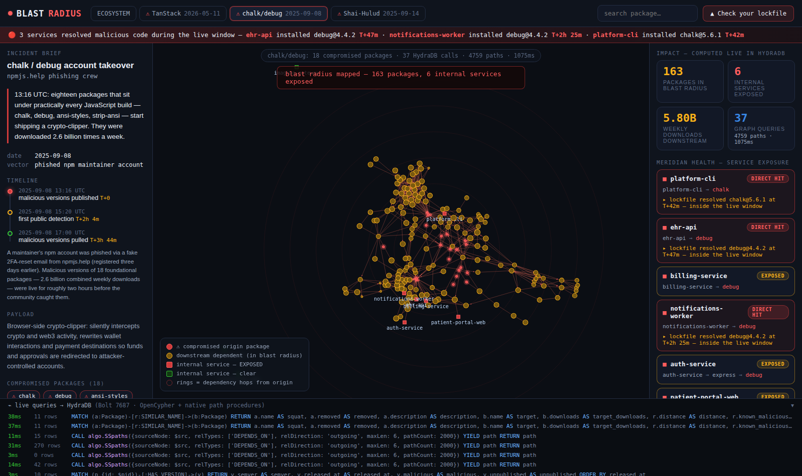
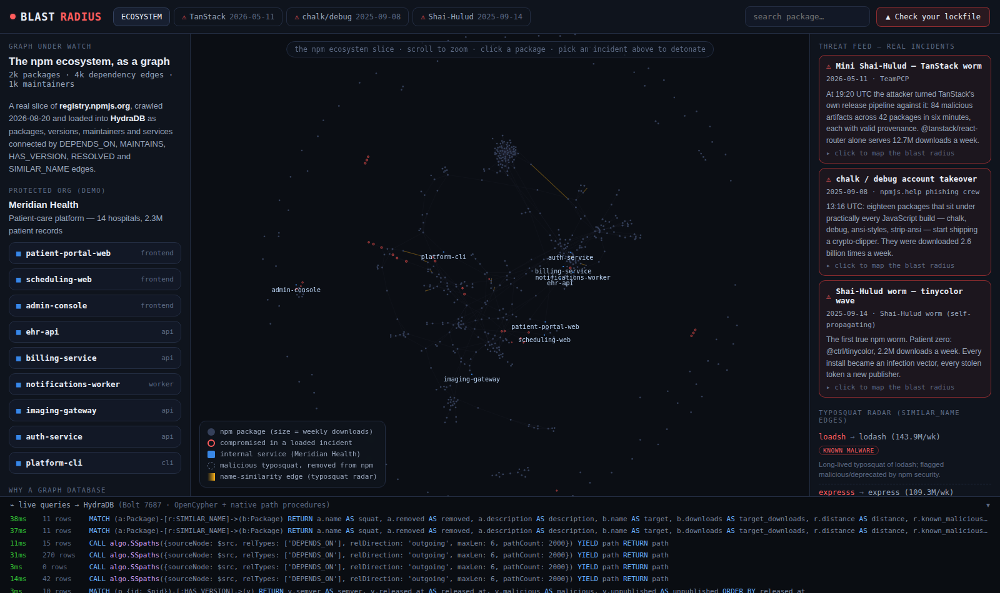
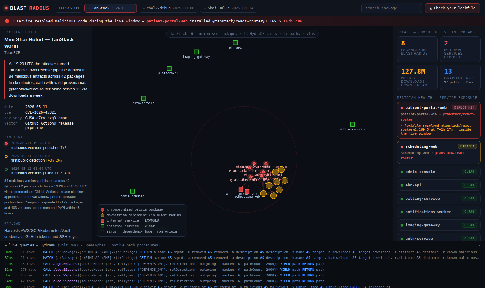
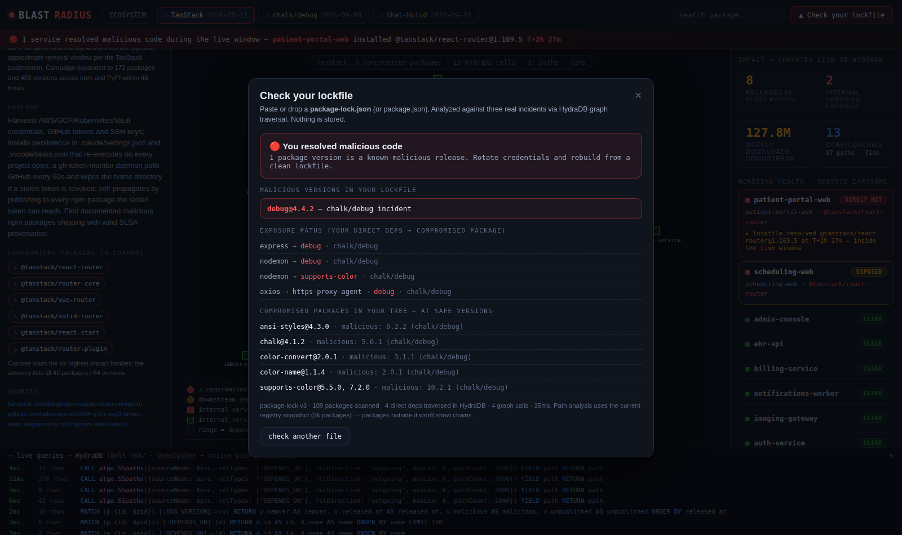
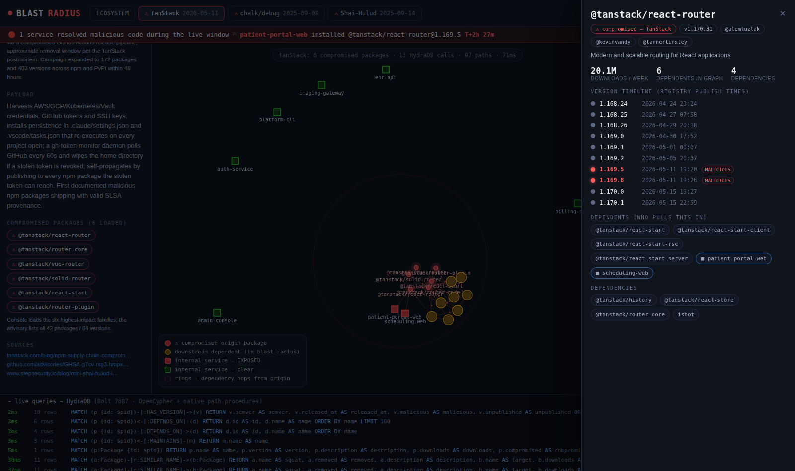

# 💥 Blast Radius

**When a package goes bad, know what it touches — in seconds, not days.**

A supply-chain incident console built on [HydraDB](https://github.com/hydra-db/hydradb) for **Hack Hydra, Track 02-A (supply chain blast radius)**. It loads a real slice of the npm ecosystem plus three real supply-chain attacks, and answers the questions that matter at 09:06 when the compromise landed at 09:00:

- **Which internal services are transitively exposed?** — reverse-dependency closure, computed by HydraDB's native `algo.SSpaths` path procedure
- **Which lockfiles resolved the malicious version while it was live?** — `RESOLVED` edges with timestamps, checked against each incident's publish window
- **Which packages share maintainers with the compromised one?** — two-hop `MAINTAINS` traversal
- **Which version introduced it?** — real registry publish timelines with malicious releases flagged
- **Are there typosquats nearby?** — `SIMILAR_NAME` edges (edit-distance scan + six documented real typosquat malware packages)
- **What's the complete blast radius?** — every dependency path from the compromised package to everything downstream, animated as a shockwave



## The incidents are real

| Incident | Date | What happened |
|---|---|---|
| **Mini Shai-Hulud / TanStack worm** (CVE-2026-45321) | 2026-05-11 | 84 malicious versions across 42 `@tanstack/*` packages published in 6 minutes through a compromised GitHub Actions pipeline — with valid SLSA provenance. Persistence via `.claude/` and `.vscode/`, home-directory dead-man switch, self-propagating. |
| **chalk / debug account takeover** | 2025-09-08 | A phished maintainer account shipped a crypto-clipper in 18 foundational packages — 2.6B combined weekly downloads — live for ~2 hours. |
| **Shai-Hulud worm — tinycolor wave** | 2025-09-14 | The first self-propagating npm worm: every install stole tokens and republished itself. 500+ packages. |

Package lists, malicious version numbers, and timelines come from the public advisories cited in `data/incidents.json`. The dependency graph, maintainer accounts, weekly download counts, and version publish timestamps are crawled live from `registry.npmjs.org` (1,748 packages, 4,299 dependency edges, 1,091 maintainers — see `scripts/build-dataset.mjs`).

The "protected org" (Meridian Health, a fictional hospital platform with nine services) is the demo overlay: its services, dependency manifests, and lockfile resolution times are curated so every incident has services that were hit during the live window, services that are only transitively exposed, and services that are clear. **Upload your own `package-lock.json` in the console to make it about you instead.**

## What HydraDB does here (everything)

Every answer on screen is a graph query — there is no precomputed analysis. The live query console at the bottom of the UI shows each Cypher statement as it hits HydraDB over Bolt.

| Question | HydraDB feature |
|---|---|
| Blast radius (all paths, all dependents) | `CALL algo.SSpaths({sourceNode, relTypes: ['DEPENDS_ON'], relDirection: 'incoming', maxLen: 6, pathCount: 4000})` — one call per compromised package, whole paths back with node labels + properties |
| Your lockfile's exposure paths | `algo.SSpaths` outgoing from each of your direct deps, intersected with the incident set |
| Who resolved malicious versions in-window | `MATCH (s:Service)-[r:RESOLVED]->(v:Version) WHERE v.malicious = true AND v.incident = $inc ...` |
| Maintainer overlap | `MATCH (p {id:$pid})<-[:MAINTAINS]-(m)-[:MAINTAINS]->(q) ...` |
| Version timelines | `MATCH (p {id:$pid})-[:HAS_VERSION]->(v) ... ORDER BY released_at` |
| Typosquat radar | `MATCH (a:Package)-[r:SIMILAR_NAME]->(b:Package) ...` |
| Search | `WHERE p.name STARTS WITH $q ... ORDER BY downloads DESC` |
| Seeding (3,115 nodes / 9,149 edges in ~2.5s) | `UNWIND $rows` batch upserts over Bolt (the neo4j driver speaks to HydraDB directly) |

Things we learned about HydraDB's Cypher subset the hard way (all handled in `server/seed.js` / `server/hydra.js`):

- Node ids are non-negative **integers**, and the JS neo4j driver sends plain numbers as floats — everything id-shaped goes through `neo4j.int()`.
- `UNWIND` vertex upserts take **exactly one** `SET` label; relationship batches need exactly one label per endpoint, so edge batches are grouped by label pair.
- Variable-length `MATCH` needs a fixed source id and only walks outgoing — reverse closures are `algo.SSpaths` with `relDirection: 'incoming'`, which is also faster and returns whole paths.
- `algo.SSpaths` enumerates simple paths shortest-first with a global `pathCount` cap — hop distances fall out of first-visit order.

## Architecture

```
┌────────────────────────── one container (fits Render free tier) ─────────────────────────┐
│                                                                                          │
│  HydraDB graph-node (loopback :7687 Bolt / :8443 HTTP / :9090 admin)                     │
│      ▲ Bolt (neo4j-driver)                                                               │
│  Node/Express app ──────────── serves UI + API on $PORT (the only exposed port)          │
│      • seeds the graph from data/graph.json on cold start (~3s)                          │
│      • every API answer = live HydraDB traversal                                         │
│                                                                                          │
└──────────────────────────────────────────────────────────────────────────────────────────┘
```

Measured under Render-free-tier limits (512MB): ~105MB RSS after boot, ~162MB after the heaviest blast query. Cold start to ready ≈ 25s (the UI shows the boot log while it seeds).

## Run it

### Deploy to Render (free tier)

1. Fork/push this repo to GitHub.
2. In Render: **New → Blueprint**, pick the repo (`render.yaml` does the rest — Docker runtime, free plan, health check on `/healthz`). Or **New → Web Service**, runtime **Docker**, plan **Free**.
3. First build takes a few minutes; first request after idle takes ~30–60s (free tier cold start + graph seeding — the boot screen narrates it).

No environment variables, no external database, no persistent disk needed: the graph reseeds itself from the committed dataset on every cold start.

### Run locally (Docker)

```bash
docker build -t blast-radius .
docker run --rm -p 3000:3000 blast-radius
# open http://localhost:3000
```

### Run locally (dev, separate processes)

```bash
# 1. HydraDB (see the hydradb README for the full flag story)
mkdir -p hydradb-data/store hydradb-data/cache
printf '%s\n' 'local-development-token-32-bytes' > hydradb-data/auth-token
docker run --rm --user "$(id -u):$(id -g)" -p 7687:7687 -p 8443:8443 -p 9090:9090 \
  -v "$PWD/hydradb-data:/data" \
  -e CLOUD_PROVIDER=local -e LOCAL_PATH=/data/store \
  -e GRAPH_NAMESPACE=default -e GRAPH_ID=default -e GRAPH_CELL_ID=cell-0 \
  -e GRAPH_CELLS=cell-0 -e GRAPH_NODE_ID=node-0 \
  -e GRAPH_BOLT_NODE_ADDRESSES=node-0=127.0.0.1:7687 \
  -e GRAPH_ADVERTISED_BOLT_ADDR=127.0.0.1:7687 \
  -e GRAPH_DATA_CACHE_DIR=/data/cache -e GRAPH_AUTH_TOKEN_FILE=/data/auth-token \
  -e GRAPH_ALLOW_PLAINTEXT=true -e RUST_MIN_STACK=33554432 \
  ghcr.io/hydra-db/hydradb:latest

# 2. the console
npm install
npm start          # http://localhost:3000

# optional: re-crawl the npm dataset (writes data/graph.json)
npm run build-dataset
```

## Screens

| | |
|---|---|
|  |  |
|  |  |

## Repo map

```
server/          Express app: boot/seed orchestration + graph API
  hydra.js       Bolt connection, neo4j.int() discipline, live query log
  seed.js        deterministic ids + UNWIND batch seeding (HydraDB batch rules)
  lockfile.js    package-lock v1/v2/v3 + package.json parsing
public/          the console UI (vanilla JS + vendored force-graph, canvas)
data/            incidents.json (curated, sourced) · org.json (demo org)
                 graph.json (committed crawl of registry.npmjs.org)
scripts/         build-dataset.mjs — the crawler that builds data/graph.json
docker/start.sh  boots graph-node + app in one container
render.yaml      one-click Render deploy (free tier)
```

## License

MIT (this project). HydraDB itself is AGPL-3.0 and runs unmodified as a separate process, spoken to over its public Bolt/HTTP APIs.
